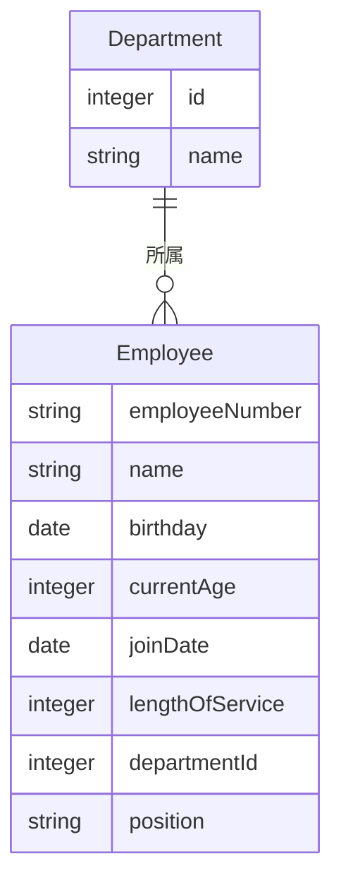
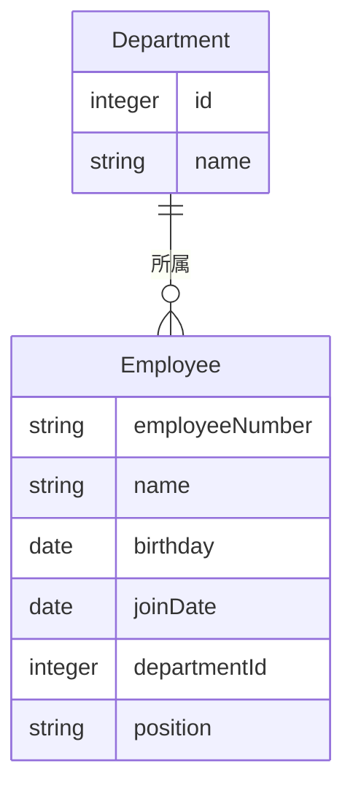
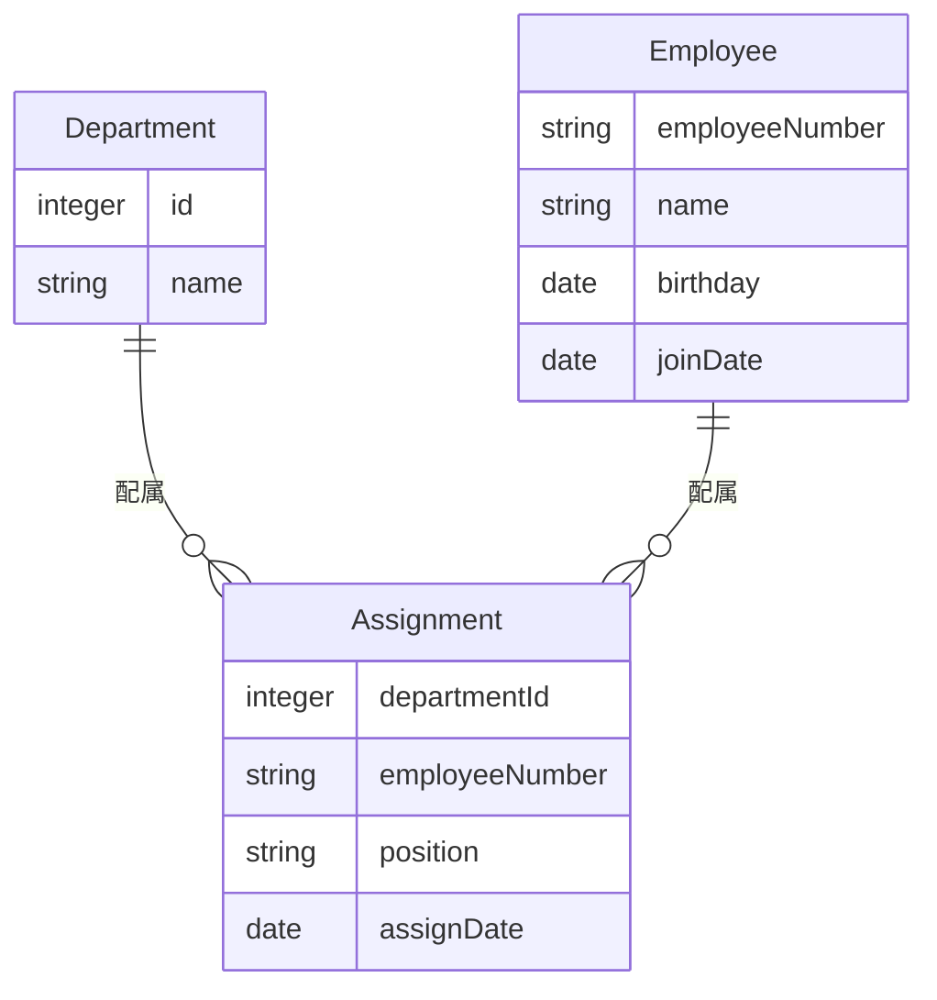
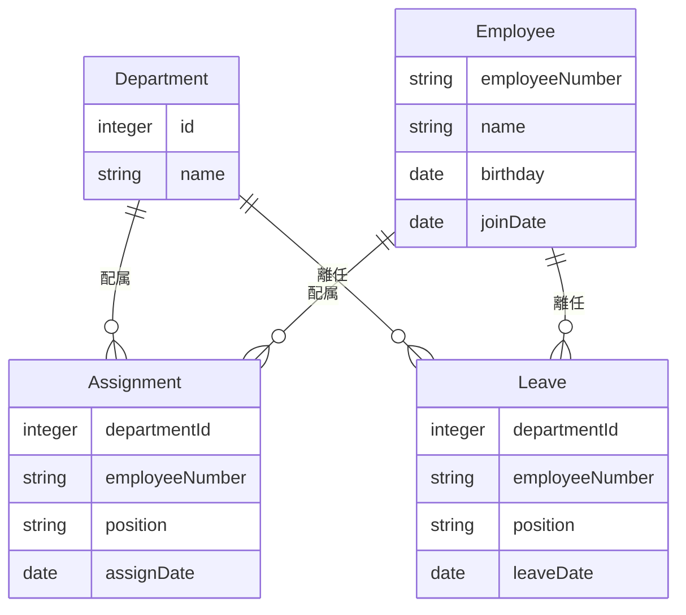
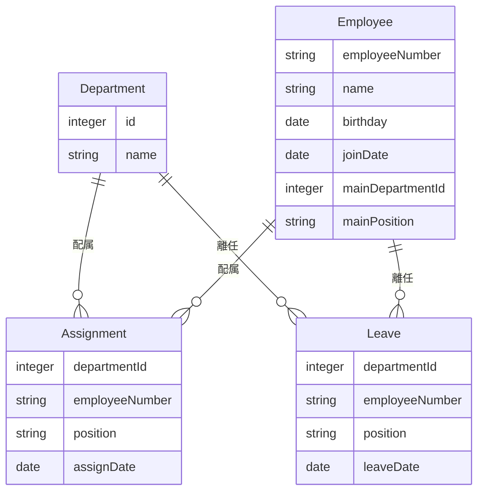

## 素朴な設計

```mermaid
erDiagram
Employee {
  string employeeNumber
  string name
  date birthday
  integer currentAge
  date joinDate
  integer lengthOfService
  integer departmentId
  string position
}

Department {
  integer id
  string name
}

Department ||--o{ Employee:"所属"

```

## 情報的な属性を除外

```mermaid
erDiagram
Employee {
  string employeeNumber
  string name
  date birthday
  date joinDate
  integer departmentId
  string position
}


Department {
  integer id
  string name
}

Department ||--o{ Employee:"所属"

```

## 配属イベントを導入

```mermaid
erDiagram
Employee {
  string employeeNumber
  string name
  date birthday
  date joinDate
}

Assignment {
  integer departmentId
  string employeeNumber
  string position
  date assignDate
}

Department {
  integer id
  string name
}

Department ||--o{ Assignment:"配属"
Employee ||--o{ Assignment:"配属"


```

## 配属と離任イベントを分割

```mermaid
erDiagram
Employee {
  string employeeNumber
  string name
  date birthday
  date joinDate
}

Assignment {
  integer departmentId
  string employeeNumber
  string position
  date assignDate
}

Leave {
  integer departmentId
  string employeeNumber
  string position
  date leaveDate
}

Department {
  integer id
  string name
}

Department ||--o{ Assignment:"配属"
Employee ||--o{ Assignment:"配属"

Department ||--o{ Leave:"離任"
Employee ||--o{ Leave:"離任"

```

## 情報をキャッシュ

```mermaid
erDiagram
Employee {
  string employeeNumber
  string name
  date birthday
  date joinDate
  integer mainDepartmentId
  string mainPosition
}

Assignment {
  integer departmentId
  string employeeNumber
  string position
  date assignDate
}

Leave {
  integer departmentId
  string employeeNumber
  string position
  date leaveDate
}

Department {
  integer id
  string name
}

Department ||--o{ Assignment:"配属"
Employee ||--o{ Assignment:"配属"

Department ||--o{ Leave:"離任"
Employee ||--o{ Leave:"離任"

```
